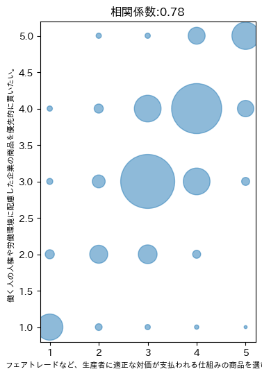
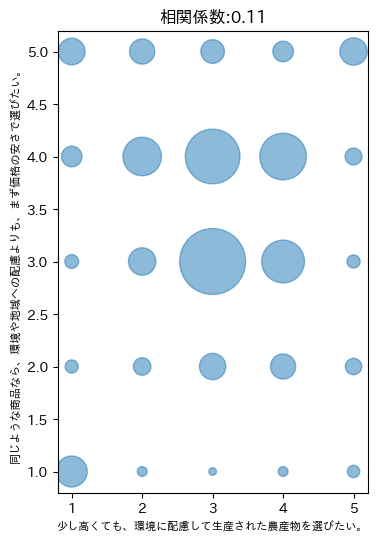
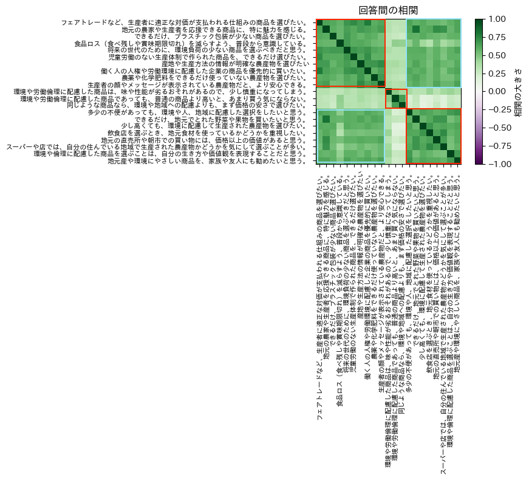
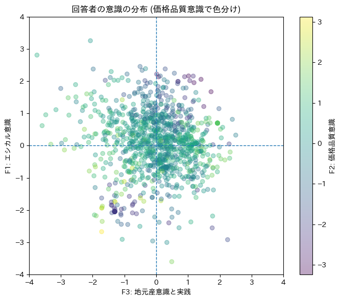

# 都市住民における地元産農産物の価値認識ーエシカル消費意識の構造分析ー

## 1. 研究の動機

* 背景1:
    * 朝霞市の**農業は、都市近郊農業**として地域住民の生活圏と近接した形で営まれている。一方で、地域住民の多くは**都市型の生活様式**を送っており、日常的な食品購買は主としてスーパー等を通じて行われている。
* 背景2:
    * このため、**地元農産物**は必ずしも「農業支援」や「地域振興」といった文脈で意識されるとは限らず、**一般的な商品選択の一部**として選択・購入されているのではないだろうか。
* 動機:
    * 近年、**都市部の消費者においては、環境配慮や生産者への配慮**といったエシカル消費的要素が購買判断に影響を与えていると指摘されている。
    * そこで、本研究では、**エシカル消費という視点を用いて、都市型生活を送る住民が地元農産物をどのような価値として認識しているのか**を、地元と全国の消費者に対する社会調査によって明らかにすることを目的とする。

### この調査は、何を明らかにしようとしているのか

この調査の目的は、

> 人は、買い物をするとき、  
> どのような考え方のまとまり（**判断の軸**）を使って選んでいるのか。  
> その中に、「エシカル消費的な考え方」は、どんな形で存在しているのか。

を明らかにすることにある。たとえば、私たちは買い物のときに、

- 値段が安いか
- 近くで手に入るか
- なんとなく安心できるか
- 環境に良さそうか

といった複数のことを、同時に考えている。

この社会調査は、  **それらが人の頭の中で、どのように「まとまって」考えられているのか** を知ろうとしている。

---

## 2. 調査上の問題点：なぜ「エシカル消費ですか？」と聞いてはいけないのか

もしアンケートで、

> 「あなたはエシカル消費をしていますか？」

と聞いたら、どうなるだろうか。

多くの人は、
- 「はい」
- 「まあ、どちらかといえば」

と答えるだろう。しかし、ここには大きな問題がある。

エシカル消費は、社会的に「良いこと」だとされている。そのため、**回答者の本音よりも「良さそうな答え」が選ばれやすい**。

### そもそも、人は倫理だけで買い物していない

現実の買い物では、

- 倫理的に正しいか
- 値段はどうか
- 便利かどうか

といった判断基準が、人それぞれの考えの中で**混ざり合って判断**される。つまり、

> エシカル消費は、都市部の住民でもはっきり意識された「規範(行動ルール)」として行動を支配しているとは限らない。

このため、**エシカル消費をそのまま言葉で聞くこと自体が難しい。**

実際、令和6年11月に公表された消費者庁の調査によると、
- https://www.caa.go.jp/notice/assets/consumer_research_cms201_241107_01.pdf

エシカル消費という言葉や内容を理解している消費者は3割弱である。

## 3. 解決方法：では、この調査ではどう聞いたのか

この調査では、

- 「エシカル消費をしていますか？」
とは聞かなかった。

代わりに、

- 地元産の農産物を選びたいか
- 環境に配慮した商品を選びたいか
- 価格の安さを優先するか

といった、**日常の農産物購入における具体的な商品選択のしかた**をたくさん(21問)聞いた。

21の質問に対する重要ポイントは、

> どの質問に「賛成」したかではなく、**どの質問群に「同じように答えたか」** である。

例えば：

* エシカル消費の意識が低い・まったくない回答者は、
    * 地元産・環境配慮・倫理に関する質問には、「そうは思わない」と回答するだろう。
    * むしろ、価格の安さや農産物のおいしさには強く賛成するだろう。
* エシカル消費を重視している「意識高い系」回答者は、
    * 地元産・環境配慮・倫理に関する質問には、「そうは思う」と回答するだろう。

## 4. 私たちの研究の「独自性」または「新しさ」

この調査が難しいのは、次の点にある。

- そもそもエシカル消費は、定義が確立した一つの考え方ではない
- 人によって、エシカル面・価格面に対する考え方の重点の置き方が違う
- 本人も、自分の判断基準を言葉にできていない

よって、私たち分析者が入手した調査データでは、

> **質問の内容には、エシカル消費を直接聞く選択肢が入っていない。**

このようなとき、

- 単純な集計：それぞれの質問で、どの回答がもっとも「賛成」されているか？
- 平均値の比較：質問の中で平均的に賛成度が高いのはどれか？

では、エシカル消費の強さ・弱さに関して、何も分からない。

そこで、因子分析を使って**質問への回答の集合全体から、エシカル消費への意向を推測**しようというのが、私たちの研究の独自性・新しさである。

## 5. なぜ因子分析を使うのか

### 5.1 因子分析とは何か（直感的な説明）

因子分析とは、

> たくさんの質問への答え方のパターンから、その背後にある「考え方のまとまり」を推定する方法

である。考え方のまとまりとは、私たちの想定では、例えば

- 「価格重視」というまとまり
- 「エシカル意識高い商品の選択・購入」

といったものである。すると、重要なのは、

- どの質問に賛成が多かったか、**ではなく**、

- **質問全体で、どれとどれが同じように回答されているか**

を見る点である。これを因子分析の手法で明らかにすることで、「考え方のまとまり」を発見していく。

### まとめ： この調査で因子分析が必要な理由

この調査では、

1. エシカル消費を直接聞けない  
2. だから具体的な選択をたくさん聞いた  
3. しかし、それらをバラバラに見ても意味がない  
4. 「考え方のまとまり」を推定する必要がある  

この流れから、**因子分析を使うことが論理的に要請される。**

---
## 6. 因子分析の実行

### 「考え方のまとまり」を知る方法：回答の相関

例えば、次の2つの質問の回答状況

#### 「ひとつの考え方」から来る回答

アンケートでは、同一趣旨の内容を聞く質問がいくつか存在する。例えば：

* フェアトレードなど、生産者に適正な対価が支払われる仕組みの商品を選びたい。
* 働く人の人権や労働環境に配慮した企業の商品を優先的に買いたい。

それぞれの質問で選ばれた回答選択肢番号を散布図で表してみよう。

相関係数の値は0.78で、強い正の相関を示している。すなわち2つの質問の回答について、

* 一方の質問で選ばれた選択肢は、
* 他方の質問でも同様に選ばれることが多い

という、はっきりとしたパターンが存在していることが分かる。

このことから、2つの質問に対して、回答者は**同じような考え方で対応している**ことが示唆される。

#### 「別の考え方」から来る回答

アンケートでは、相反するような内容の質問も聞いている：

* 少し高くても、環境に配慮して生産された農産物を選びたい。
* 同じような商品なら、環境や地域への配慮よりも、まず価格の安さで選びたい。

それぞれの質問で選ばれた回答選択肢番号を散布図で表してみよう。

相関係数の値は0.11＝無相関に近い、すなわち2つの質問の回答選択パターンに特定の傾向がないことが分かる。

このことから、2つの質問に対して、回答者は**別の考え方で対応している**ことが示唆される。

#### 重要ポイント

以上をまとめると：

* 回答選択肢の**相関が強い**質問ペアは、**同じ考え方**で回答されている
* 回答選択肢の**相関が弱い**質問ペアは、**異なる考え方**で回答されている

この分析手法を用いて

* **互いに相関が強い質問ペア**のグループ
* **相関が弱い**グループ

を明らかにするのが、因子分析である。

#### 全ての質問ペアで、回答の相関を調べる

21の質問について、ペアを作り相関係数を計算し、その結果をヒートマップで表したのが下図である。

相関が強い質問グループは、**3つ**あることが発見された。これらが、「考え方のまとまり」を表す**因子**と考えられる。
- **左上のブロック**
    * 食品ロス（食べ残しや賞味期限切れ）を減らすよう、普段から意識している。
    * 将来の世代のために、環境負荷の少ない商品を選ぶべきだと思う。
    * 児童労働のない生産体制で作られた商品を、できるだけ選びたい。
    * 働く人の人権や労働環境に配慮した企業の商品を優先的に買いたい。
    * フェアトレードなど、生産者に適正な対価が支払われる仕組みの商品を選びたい。
    * 産地や生産方法の情報が明確な農産物を選びたい
    * できるだけ、プラスチック包装が少ない商品を選びたい。
    * 農薬や化学肥料をできるだけ使っていない農産物を選びたい。
    * 生産者の顔やメッセージが表示されている農産物だと、より安心できる。
    * 地元の農家や生産者を応援できる商品に、特に魅力を感じる。
- **真ん中のブロック**
    * 環境や労働倫理に配慮した商品であっても、普通の商品より高いと、あまり買う気にならない。
    * 同じような商品なら、環境や地域への配慮よりも、まず価格の安さで選びたい。
    * 環境や労働倫理に配慮した商品は、味や性能が劣るおそれがあるので、少し慎重になってしまう。
- **右下のブロック**
    * 飲食店を選ぶとき、地元食材を使っているかどうかを重視したい。
    * スーパーや店では、自分の住んでいる地域で生産された農産物かどうかを気にして選ぶことが多い。
    * 少し高くても、環境に配慮して生産された農産物を選びたい。
    * 多少の不便があっても、環境や人、地域に配慮した選択をしたいと思う。
    * 地元の直売所や朝市での買い物には、価格以上の価値があると思う。
    * 地元産や環境にやさしい商品を、家族や友人にも勧めたいと思う。
    * 環境や倫理に配慮した商品を選ぶことは、自分の生き方や価値観を表現することだと思う。
    * できるだけ、地元でとれた野菜や果物を買いたいと思う。

因子分析は、この発見を統計的に明らかにする方法である。

### 3つの因子の解釈

#### 左上ブロック＝規範的エシカル

* フェアトレード
* 人権・労働環境
* 将来世代
* 食品ロス

**👉抽象的・規範的なエシカル意識は、回答者の中で一つの考え方のまとまりとして存在している。**

#### 中央付近のブロック＝価格・品質重視

* 価格の安さを優先
* 高いと買わない
* 味・性能への不安

**👉価格・品質への懸念は、エシカル意識とは独立した判断軸（考え方のまとまり）。**

#### 右下ブロック＝地元産への実践意識

* 地元産を選ぶ
* 直売所の価値
* 地元食材の飲食店
* 勧めたい／自己表現

**👉地元産に対する意識は、規範的エシカル意識とは別のまとまりを持つ。**

#### 左上と右下の境界（右上・左下）

左上ブロックと右下ブロックの境界は、
* 完全に薄い（無相関）わけではない
* しかし同一ブロックほど強い相関があるわけでもない(濃くない)。

**👉では、エシカル意識と地元産農産物に対する意識はどんな関係にあるのだろうか？**

### 回答者の意識の方向性を見出す

全体的に

* 第1象限：**エシカル意識：高、地元産意識：高**
    * エシカル消費・地元産重視行動につながりやすい層
    * 価格品質意識が低い人が集まっている。
* 第2象限：**エシカル意識：高、地元産意識：低**
    * エシカル意識は高いが、だからといって地元産を意識的に購入するわけではない。
* 第3象限：**エシカル意識：低、地元産意識：低**
    * 価格品質意識が高い人が集中している。
    * エシカル・地元産を意識せず、安さや品質を重視
* 第4象限：**エシカル意識：低、地元産意識：高**
    * エシカル意識は強くないが、地元産を購入する傾向
    * 地元産を選ぶことで「結果的に無意識なエシカル消費を行なってる」層

価格重視の違い（色の違い）は、4つの象限の様々な場所で見られる→他の質問グループと相関が低いことの証拠。

## 7. 因子分析によって分かったこと

因子分析の結果、回答のまとまりを発見することで、

地元産農産物の消費は、規範的エシカルと完全に一致しない。しかし完全に無関係でもないことを意味している。

## 8. スライド構成案

### 1枚目　課題と方法

* 朝霞市は都市近郊農業
* 住民は都市型の生活者
* 住民にとっての地元産農産物の価値の捉え方は自明ではない
    *「エシカル消費」を意識して買っているのかは分からない
	* そこで、地域住民の意識の構造そのものを調べる

→ 地元産農産物はエシカル消費とどう関係づけられているのか？

### 2枚目　調査と分析結果

* 全国オンライン調査（回答数：1100）
* 地元産意識・環境/人権意識・価格/品質に関する、合計21の質問
    * 5段階リカートスケールで回答
* 因子分析（探索的）
    * まず、設問どうしの回答の相関を可視化した
	* すると、明確な3つの相関ブロックが見えた
	* これを根拠に、因子数を3とした

→ 回答の相関から3つのまとまりが見える

### 3枚目　3つの因子の解釈

* エシカル意識
* 価格/品質の意識
* 地元産意識

* 回答者の分布の図の説明

### 4枚目　結論

* 地元産農産物は「エシカル」より「生活に合う価値」で選ばれている。
    * 都市住民は倫理を強く意識せず、身近さ・安心感から地元産を選んでいる。
* 行動を分ける決定要因は、価格・品質に対する意識も大きい
    * 価値観（エシカル・地元志向）があっても、ブレーキが強いと購入に至らない。
* 無意識的にエシカルな行動をしている層が都市部に存在する。
    * エシカルと自覚せずに、結果として地産地消・環境配慮につながっている。
* 朝霞市への提言
    * s「エシカル」を強調せず、「身近・安心・使いやすい」地元産を提示する。
    * 価格・品質・利便性の見える化が、持続的利用につながる。